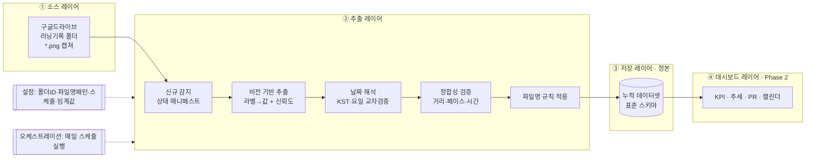

# 러닝기록 자동화 & 누적 대시보드 기획서 (v1)

> 프로젝트: **자동발행** · 작성일: 2026-07-23 (KST) · 상태: Phase 0 기획(안)
> 목적: 구글드라이브 `러닝기록` 폴더의 러닝 앱 캡쳐 이미지를 **자동으로 데이터화 → 누적 → 대시보드**로 잇는 파이프라인을 확장성 있게 설계한다.

---

## 0. 요약 (Executive Summary)

구글드라이브 `러닝기록` 폴더에 쌓이는 러닝 앱 캡쳐 이미지를, 사람이 손대지 않아도 **① 이미지에서 기록을 읽어 구조화 데이터로 변환**하고, **② 날짜·기록 기반으로 파일명을 정리**하며, **③ 하나의 누적 데이터셋에 계속 적재**하고, **④ 이후 대시보드에서 열람**할 수 있게 하는 것이 목표다.

핵심 설계 방향은 **레이어 분리(소스 · 추출 · 저장 · 대시보드)**다. 각 레이어를 독립적으로 교체·확장할 수 있게 만들어, "지금은 간단하게 시작하고 나중에 대시보드/저장소를 자유롭게 키운다"는 요구(확장성)를 구조적으로 보장한다. 추출은 좌표 고정 OCR이 아니라 **비전(멀티모달) 기반**으로 설계해 앱 화면 레이아웃이 바뀌거나 앱이 달라져도 견디게 한다.

이 문서는 **Phase 0(기획)** 산출물이다. 실제 파이프라인·대시보드 구축은 본 기획 확정 후 단계별로 진행한다.

---

## 1. 현황 분석

### 1.1 드라이브 연결 확인
- `러닝기록` 폴더 연결 정상 확인.
  - 폴더 ID: `1nS5kvPDMBWFqYIGZDaOe5nmMukunSUEO`
  - 소유자: cdhrich@gmail.com · 위치: 내 드라이브
- 현재 폴더 내 파일: **캡쳐 이미지 1건** (`IMG_5072.PNG`, PNG, 약 699KB)
  - 파일 ID: `1IDlv1mV5pWTjc4jRV8b2DuuVPOVQZ0jp`
  - 드라이브 업로드 시각: 2026-07-23 22:26 UTC = **2026-07-24 07:26 (KST, 금요일)**

### 1.2 샘플 이미지 분석 (IMG_5072.PNG)
러닝 앱의 활동 상세 화면 캡쳐로, 한 번의 러닝 세션에 대한 다음 지표가 담겨 있다.

| 화면 표기 | 의미 | 읽힌 값 |
|---|---|---|
| 오늘 · 06:03 / 금요일 오전 러닝 | 날짜·시작시각·세션명 | 오늘 06:03 시작, "금요일 오전 러닝" |
| 3.27 킬로미터 | 거리 | 3.27 km |
| 5'35" 평균 페이스 | 평균 페이스 | 5분 35초 / km |
| 18:16 시간 | 총 소요시간 | 18분 16초 |
| 167 칼로리 | 소모 칼로리 | 167 kcal |
| 케이던스 | 분당 걸음수 | (그리드 값 — 아래 1.3 참고) |
| 고도(평균/상승) | 고도 | (그리드 값) |
| 심박수 | 평균 심박수 | (그리드 값) |
| 서울특별시, 대한민국 | 위치 | 서울 |
| 지도 + 1km/2km/3km 마커, 도로명(선릉로190길, 뚝섬로5길, 성수이로, 강변북로 등) | 경로 | 성수/한강 인근 |

**정합성 교차검증:** 3.27 km × 5'35"(=335초/km) ≈ 1,096초 ≈ **18:16** → 거리·페이스·시간이 서로 일치. 추출 신뢰도 자동 검증 규칙으로 활용 가능(§6.3).

### 1.3 이번 분석에서 드러난 핵심 이슈 (설계에 직접 반영)

1. **텍스트 OCR만으로는 결측이 발생한다.** 표준 OCR로 읽었을 때 거리·페이스·시간·칼로리는 잡혔지만 **케이던스·고도·심박수의 숫자 값이 누락**됐다. 이 지표들이 화면 하단 격자(grid) 레이아웃에 배치돼 단순 텍스트 추출이 순서를 잃기 때문이다. → **비전 기반 추출**이 필요한 결정적 근거(§6).
2. **절대 날짜가 이미지에 없다.** 화면은 "오늘 06:03 · 금요일"처럼 **상대 표기**만 보여준다. 파일명(IMG_5072)에도 날짜가 없다. → 별도의 **날짜 해석 로직**이 반드시 필요(§5.2). 다행히 이번 건은 드라이브 업로드 시각을 KST로 변환하면 금요일과 일치해 자동 확정 가능함을 검증함.
3. **앱/언어 다양성 가능성.** 지금은 한국어 화면이지만, 향후 다른 러닝 앱·영문 화면·다른 크롭이 섞일 수 있다. → 좌표 고정이 아니라 **의미 기반(라벨→값) 추출**로 설계해야 확장 가능.
4. **드라이브 파일 쓰기 제약.** 현재 드라이브 커넥터로는 파일 "부분 수정/append"가 제한적이다. → 누적 저장은 **정본 파일을 읽어 병합 후 전체 재기록**하거나, append가 자유로운 DB(Supabase 등)로 승격하는 경로를 함께 설계(§7).

---

## 2. 목표 & 성공 기준

**목표**
1. 폴더에 새 캡쳐가 올라오면 **자동으로** 구조화 데이터로 변환·누적한다.
2. 각 이미지를 **일자 + 핵심 기록 기반 파일명**으로 정리한다.
3. 누적 데이터를 **단일 정본(source of truth)**으로 관리한다.
4. 이후 붙일 **대시보드가 이 정본만 바라보면 되도록** 저장·표현을 분리한다.

**성공 기준 (측정 가능)**
- 새 이미지 1건 처리 시, 정의된 핵심 지표(거리·페이스·시간·칼로리·심박수·케이던스·고도·날짜)를 **필드 채움률 ≥ 목표치**로 추출하고, 정합성 검증(§6.3)을 통과한다.
- 동일 이미지를 다시 처리해도 **중복 적재가 생기지 않는다**(멱등성).
- 저장소를 바꿔도 **추출 로직은 그대로**, 대시보드를 바꿔도 **저장소는 그대로**다(레이어 독립성).

---

## 3. 전체 아키텍처

**레이어 분리 원칙** — 4개 레이어가 표준 데이터 계약(§4 스키마)으로만 연결되고, 서로의 내부 구현을 모른다. 어느 레이어든 독립 교체가 가능하다.



**데이터 흐름 한 줄 요약:** 드라이브 신규 캡쳐 → (감지 → 비전 추출 → 날짜 확정 → 정합성 검증 → 파일명 정리) → 누적 정본에 append → 대시보드가 정본을 읽어 시각화.

---

## 4. 데이터 설계

### 4.1 러닝 레코드 스키마 (레코드 1건 = 러닝 세션 1회)

> 저장소 중립적(storage-agnostic) 설계. JSON 객체 그대로도, DB 컬럼으로도, 시트 열로도 매핑된다. 신규 필드는 **모두 nullable/optional**로 추가해 과거 레코드 무효화 없이 확장한다(§10).

| 필드 | 타입 | 설명 | 예시(IMG_5072) |
|---|---|---|---|
| `record_id` | string | 고유 ID(원본 파일ID 또는 콘텐츠 해시) | `1IDlv1mV5pW...` |
| `date` | date (YYYY-MM-DD) | 러닝 실시 날짜(§5.2로 확정) | `2026-07-24` |
| `weekday` | string | 요일 | `금` |
| `start_time` | time (HH:MM) | 시작 시각 | `06:03` |
| `day_part` | enum | 오전/오후/저녁 | `오전` |
| `title` | string | 세션명 | `금요일 오전 러닝` |
| `distance_km` | number | 거리(km) | `3.27` |
| `duration_sec` | int | 총 시간(초) | `1096` |
| `duration_text` | string | 총 시간(표시용) | `18:16` |
| `avg_pace_sec_per_km` | int | 평균 페이스(초/km) | `335` |
| `avg_pace_text` | string | 평균 페이스(표시용) | `5'35"` |
| `calories` | int | 칼로리(kcal) | `167` |
| `cadence_spm` | int | 케이던스(spm) | (추출 대상) |
| `avg_heart_rate_bpm` | int | 평균 심박수 | (추출 대상) |
| `max_heart_rate_bpm` | int | 최대 심박수(있으면) | (추출 대상) |
| `elevation_avg_m` | number | 평균 고도(m) | (추출 대상) |
| `elevation_gain_m` | number | 누적 상승고도(m) | (추출 대상) |
| `location` | string | 위치 | `서울특별시, 대한민국` |
| `route_summary` | string[] | 경로 도로명·구간 | `[선릉로190길, 성수이로, 강변북로]` |
| `app_source` | string | 앱 추정(확장용) | `러닝앱(미확정)` |
| `source_file_id` | string | 드라이브 파일 ID | `1IDlv1mV5pW...` |
| `original_filename` | string | 원본 파일명 | `IMG_5072.PNG` |
| `renamed_filename` | string | 정리된 파일명(§5.1) | `20260724_0603_3.27km_0535.png` |
| `image_url` | string | 드라이브 열람 링크 | `https://drive.google.com/...` |
| `date_source` | enum | 날짜 확정 근거(exif/drive_ctime/manual) | `drive_ctime+요일일치` |
| `confidence` | object | 필드별/전체 추출 신뢰도 | `{overall: 0.9, ...}` |
| `needs_review` | bool | 사람 확인 필요 플래그 | `false` |
| `raw_ocr` | string | 원본 텍스트(감사·재처리용) | `...` |
| `extracted_at` | timestamp | 추출 시각 | `2026-07-24T...` |
| `schema_version` | string | 스키마 버전 | `1.0` |

### 4.2 파생·집계 지표 (대시보드용 — 정본에서 계산, 저장 안 해도 됨)
- **누적:** 총 거리, 총 러닝 횟수, 총 시간, 총 칼로리, 누적 상승고도.
- **기간 집계:** 주간/월간 거리·횟수·평균 페이스, 롤링 7일/28일 마일리지.
- **개인기록(PR):** 최장 거리, 최고 평균 페이스, 최다 칼로리, 최장 시간.
- **추세:** 페이스 추이, 거리 추이, 심박수 대비 페이스, 페이스 대비 거리.
- **습관:** 연속 러닝(스트릭), 요일별/시간대별 빈도, 월별 캘린더 히트맵.
- **목표(확장):** 월 목표 거리 대비 진척률 등.

### 4.3 워크드 예시 (현재 이미지 1건 → 레코드)
```json
{
  "record_id": "1IDlv1mV5pWTjc4jRV8b2DuuVPOVQZ0jp",
  "date": "2026-07-24", "weekday": "금", "start_time": "06:03", "day_part": "오전",
  "title": "금요일 오전 러닝",
  "distance_km": 3.27,
  "duration_sec": 1096, "duration_text": "18:16",
  "avg_pace_sec_per_km": 335, "avg_pace_text": "5'35\"",
  "calories": 167,
  "cadence_spm": null, "avg_heart_rate_bpm": null,
  "elevation_avg_m": null, "elevation_gain_m": null,
  "location": "서울특별시, 대한민국",
  "route_summary": ["선릉로190길", "뚝섬로5길", "성수이로", "강변북로"],
  "source_file_id": "1IDlv1mV5pWTjc4jRV8b2DuuVPOVQZ0jp",
  "original_filename": "IMG_5072.PNG",
  "renamed_filename": "20260724_0603_3.27km_0535.png",
  "image_url": "https://drive.google.com/file/d/1IDlv1mV5pWTjc4jRV8b2DuuVPOVQZ0jp/view",
  "date_source": "drive_ctime+요일일치",
  "confidence": { "overall": 0.9 },
  "needs_review": false,
  "schema_version": "1.0"
}
```
> `null`로 표시된 케이던스·심박수·고도는 표준 OCR이 놓친 값으로, **비전 추출 단계에서 채운다**. (이 결측이 바로 비전 방식을 택한 이유다.)

---

## 5. 파일명 규칙 & 날짜 해석

### 5.1 파일명 규칙 (일자 + 기록 기반)
**제안 포맷:** `YYYYMMDD_HHMM_{거리}km_{페이스}.png`
- 예: `20260724_0603_3.27km_0535.png` (2026-07-24 06:03 시작, 3.27km, 5'35" 페이스)
- 장점: 날짜순 자동 정렬, 파일명만 봐도 핵심 기록 파악, 중복 방지(날짜+시각 유일성).
- 규칙은 **설정값**으로 관리 → 원하면 `{날짜}_{세션명}` 등으로 손쉽게 변경.
- 원본 훼손 방지 옵션: (a) 리네임 후 원본 대체, (b) 원본 보존 + 사본 리네임, (c) `원본/`·`정리됨/` 하위 폴더 분리. → 구축 시 택1(기본 권장: b 또는 c로 안전하게 시작).

### 5.2 날짜 해석 로직 (이미지에 절대 날짜가 없으므로 필수)
우선순위와 교차검증:
1. **EXIF `DateTimeOriginal`** 이 있으면 최우선(촬영 시각).
2. 없으면 **드라이브 `createdTime`을 KST로 변환**해 날짜 후보로 사용.
3. **이미지 속 요일(예: "금요일")과 후보 날짜의 요일이 일치**하면 자동 확정(신뢰도↑).
   - 이번 샘플: 드라이브 createdTime → KST 2026-07-24(금) ↔ 이미지 "금요일" **일치 → 자동 확정**.
4. 불일치·모호하면 `needs_review = true`로 표시하고, 사람이 한 번에 검토·수정.
5. 향후 앱 화면에 절대 날짜가 보이는 크롭이면 그 값을 최우선 사용(규칙 우선순위에 삽입).

---

## 6. 추출 파이프라인 설계

### 6.1 왜 비전(멀티모달) 기반인가
- 러닝 앱 화면은 **아이콘·격자·지도 위 숫자**가 섞인 인포그래픽이라, 좌표 고정 OCR은 순서를 잃고 값(케이던스·심박수·고도)을 놓친다(§1.3에서 실증).
- 비전 기반은 **"라벨의 의미"로 값을 매칭**하므로 레이아웃·앱·언어가 바뀌어도 견딘다 → 확장성의 핵심.
- 원본 텍스트(raw OCR)는 **감사·재처리용으로 함께 보관**한다.

### 6.2 처리 단계
1. **신규 감지:** 폴더 스캔 → 상태 매니페스트(이미 처리한 file_id/해시)와 대조해 **새 이미지만** 선별(멱등·증분).
2. **추출:** 각 이미지를 표준 스키마(§4.1)에 맞춰 값 + 필드별 신뢰도로 구조화.
3. **날짜 확정:** §5.2 로직 적용.
4. **정합성 검증:** §6.3.
5. **파일명 정리:** §5.1.
6. **적재:** 정본에 append(멱등 upsert) → 매니페스트 갱신.
7. **로그/리포트:** 처리 건수·실패·`needs_review` 목록 요약.

### 6.3 자동 정합성 검증 규칙
- **페이스 × 거리 ≈ 시간** (오차 허용범위 내). 벗어나면 재추출 또는 `needs_review`.
- 값 범위 sanity check: 페이스(예: 2\~15분/km), 심박수(60\~220), 케이던스(120\~220 등).
- 중복 방지: `source_file_id` 또는 (날짜+시작시각+거리) 조합 유일성.

---

## 7. 저장소 설계 (정본)

**설계 철학:** 저장소는 **스키마(§4)만 지키면 무엇이든 교체 가능**. 따라서 "지금 가장 마찰 없는 것으로 시작하고, 대시보드가 커지면 승격"하는 전략을 권장.

| 옵션 | 누적 방식 | 장점 | 제약 | 적합 시점 |
|---|---|---|---|---|
| **A. 드라이브 내 JSON(정본)+CSV(열람용)** ⭐권장 시작 | 정본 읽기→병합→재기록 | 신규 인프라 0, 이미지와 같은 공간, 완전 이식 가능 | 동시성·대용량엔 약함 | Phase 1 즉시 시작 |
| **B. Supabase(PostgreSQL)** ⭐권장 승격 | `INSERT/UPSERT` | 깔끔한 append·쿼리·확장성·웹 대시보드 최적 | 프로젝트 생성 등 초기 설정 | 대시보드 본격화 시 |
| C. Notion DB | 페이지 생성 | 페이지+갤러리/차트 뷰 한 곳, 즉시 열람 | 복잡 시각화·대용량 제약 | 가벼운 올인원 원할 때 |
| D. 구글 시트 + Looker | 행 추가 | 친숙, Looker 연동 | 자동 append에 별도 스크립트 필요 | 시트 친화 사용자 |

**권장 경로:** **A로 시작(정본 JSON + 열람용 CSV, 둘 다 드라이브)** → 대시보드를 본격화할 때 **동일 스키마 그대로 B(Supabase)로 승격**. 추출 레이어는 저장 어댑터만 바꾸면 되므로 재작업이 없다.

---

## 8. 자동화 · 오케스트레이션

- **실행 주기(권장):** 매일 정해진 시각(예: KST 아침)에 폴더를 스캔해 **새 이미지만** 처리. 러닝 후 캡쳐를 폴더에 넣어두면 다음 실행에서 자동 반영.
- **구현 방식:** **스케줄 작업**(매 실행이 새 세션)으로 등록. 매 실행이 무상태이므로 파이프라인은 **자기완결형**이어야 함 → 폴더ID·파일명 규칙·임계값·저장 위치를 **설정으로 고정**하고, 진행상태는 **매니페스트(정본 옆)**에 저장.
- **대안 주기:** 수동 일괄 / 주 1회. 설정만 바꾸면 전환 가능.
- **알림(확장):** 처리 요약·`needs_review` 발생 시 푸시/메일 통지 옵션.

> 주의: 스케줄 작업은 재시작·세션 종료와 무관하게 도는 방식으로 등록해야 안전하다(휘발성 인메모리 스케줄러 금지). 구축 단계에서 반영.

---

## 9. 대시보드 기획 (Phase 2 · 확장 포인트)

정본 데이터만 읽어 렌더. 초기 구성 제안:
- **상단 KPI 카드:** 총 거리 · 총 횟수 · 총 시간 · 총 칼로리 · 이번 달 거리 · 현재 스트릭.
- **추세 차트:** 주간/월간 거리 막대, 페이스 추이 라인, 심박수-페이스 산점도.
- **캘린더 히트맵:** 날짜별 러닝 유무·거리 강도.
- **개인기록(PR) 보드:** 최장 거리 / 최고 페이스 / 최다 칼로리.
- **최근 러닝 리스트:** 썸네일(원본 캡쳐 링크) + 핵심 지표.
- **필터:** 기간·거리대·요일·시간대.
- **확장 후보:** 월 목표 대비 진척, 코스(위치)별 통계, 신발/장비 태깅, 날씨 연동, 주간 리포트 자동 발행("자동발행"과 연계).

표현 형태는 저장소 선택과 함께 확정: 정적 HTML 대시보드(드라이브) / Looker Studio(시트) / Notion 뷰 / 웹앱(Supabase+Vercel).

---

## 10. 확장성 설계 원칙 (요구사항 "확장성" 대응)
1. **레이어 독립:** 소스·추출·저장·대시보드를 스키마 계약으로만 연결 → 어디든 단독 교체.
2. **저장소 중립 스키마:** JSON↔DB↔시트↔Notion 무손실 매핑.
3. **앱 무관 추출:** 좌표가 아닌 의미(라벨→값) 기반 → 앱/언어/레이아웃 변화에 강함.
4. **증분·멱등:** 매니페스트로 새 것만, 재실행해도 중복 없음.
5. **가산적 스키마:** 신규 필드는 optional/nullable + `schema_version` → 과거 데이터 무효화 없음.
6. **설정 주도:** 폴더ID·파일명 규칙·스케줄·임계값·저장 위치를 한 곳에서 관리.
7. **감사 가능성:** raw OCR·신뢰도·원본 링크·`needs_review`를 레코드에 보관 → 신뢰·수정 용이.

---

## 11. 단계별 로드맵

| 단계 | 내용 | 산출물 | 상태 |
|---|---|---|---|
| **Phase 0** | 기획 확정(본 문서): 스키마·파일명·날짜 로직·아키텍처 | 기획서 | ✅ (검토 대기) |
| **Phase 1** | 추출 파이프라인: 현재 1건 검증 → 폴더 일괄 → 정본(JSON/CSV) 생성 + 파일명 정리 | 데이터셋·정리된 파일 | 대기 |
| **Phase 2** | 자동화: 스케줄 작업 등록, 증분·멱등·매니페스트, 처리 리포트 | 자동 실행 파이프라인 | 대기 |
| **Phase 3** | 대시보드: 정본 기반 KPI·추세·PR·캘린더 | 대시보드 | 대기 |
| **Phase 4** | 확장: 목표/스트릭, 다중 앱, 알림, (필요 시)Supabase 승격, 주간 자동발행 | 고도화 기능 | 대기 |

---

## 12. 리스크 & 대응

| 리스크 | 영향 | 대응 |
|---|---|---|
| 이미지에 절대 날짜 없음("오늘") | 날짜 오적재 | EXIF→KST createdTime→요일 교차검증, 불일치 시 `needs_review`(§5.2) |
| 앱/레이아웃/언어 상이 | 추출 누락 | 의미 기반 비전 추출 + 신뢰도·정합성 검증(§6) |
| 일부 지표 결측(케이던스/심박 등) | 필드 공백 | nullable 허용, 결측 표시, 앱별 제공 여부 반영 |
| 중복 업로드 | 이중 집계 | file_id/해시·(날짜+시각+거리) 유일성 멱등 upsert |
| 드라이브 파일 쓰기 제약 | append 불편 | 정본 병합-재기록 or Supabase 승격(§7) |
| 스케줄 세션 무상태 | 상태 유실 | 자기완결 설계 + 정본 옆 매니페스트, 영속 스케줄로 등록(§8) |
| 원본 리네임 사고 | 파일 손실 | 원본 보존/사본 리네임 or 하위 폴더 분리(§5.1) |

---

## 13. 다음 액션 (결정 필요 · 검토 요청)

아래만 정해주시면 바로 Phase 1에 착수합니다. 미정 시 **각 항목의 권장값**으로 진행합니다.

1. **저장소 시작점:** A(드라이브 JSON/CSV) *권장* / B(Supabase) / C(Notion) / D(시트).
2. **자동화 주기:** 매일 자동 *권장* / 수동 / 주 1회.
3. **파일명 규칙:** `YYYYMMDD_HHMM_{거리}km_{페이스}` *권장* — 다른 형식 원하면 지정.
4. **원본 처리:** 사본 리네임(원본 보존) *권장* / 원본 대체 / 하위 폴더 분리.
5. **이번 세션 범위:** 기획 확정만 / 기획+현재 1건 실제 데이터화 / 기획+임시 대시보드.

---

*본 문서는 자동발행 프로젝트의 Phase 0 산출물이며, 결정 사항 반영 시 버전업(v2)합니다.*
